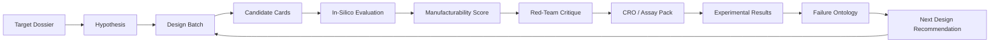

# Peptide Discovery Flywheel Diagram

```mermaid
flowchart LR
    A[Target Dossier] --> B[Hypothesis]
    B --> C[Design Batch]
    C --> D[Candidate Cards]
    D --> E[In-Silico Evaluation]
    E --> F[Manufacturability Score]
    F --> G[Red-Team Critique]
    G --> H[CRO / Assay Pack]
    H --> I[Experimental Results]
    I --> J[Failure Ontology]
    J --> K[Next Design Recommendation]
    K --> C
```
