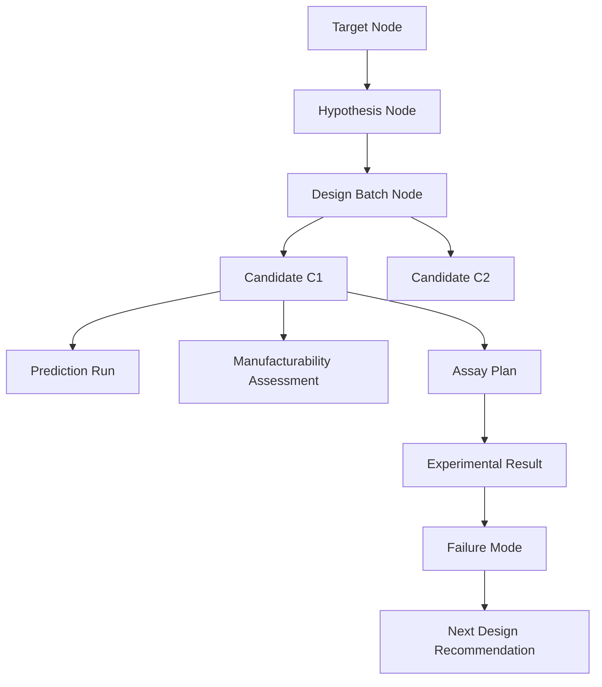

# Research DAG Diagram

```mermaid
flowchart TD
    T1[Target Node] --> H1[Hypothesis Node]
    H1 --> DB1[Design Batch Node]
    DB1 --> C1[Candidate C1]
    DB1 --> C2[Candidate C2]
    C1 --> P1[Prediction Run]
    C1 --> M1[Manufacturability Assessment]
    C1 --> A1[Assay Plan]
    A1 --> R1[Experimental Result]
    R1 --> F1[Failure Mode]
    F1 --> N1[Next Design Recommendation]
```
